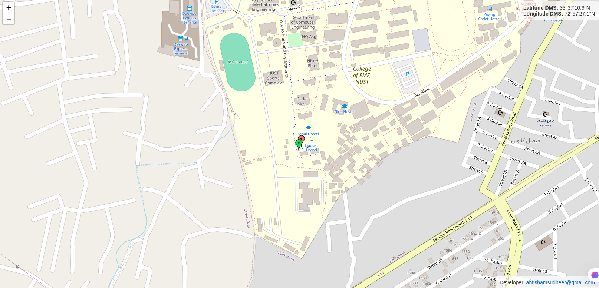

# **TrackSphere 🌎 🧭 **  
      
   

---

## 📝 **Introduction**  
**TrackSphere** is a **real-time GPS tracking web application** that captures live location data from a connected **USB GPS device** and visualizes it on an interactive map. It features **automatic port detection**, **dynamic port assignment**, **DMS (Degrees, Minutes, Seconds) conversion**, and **route history tracking** for seamless real-time navigation.  

---

## 🚀 **Features**  
✔️ **Automatic GPS port detection** on Windows & Linux  
✔️ **Dynamic port selection** for hassle-free deployment  
✔️ **Real-time GPS tracking** with interactive **Leaflet.js maps**  
✔️ **DMS conversion** for precise geographic representation  
✔️ **Standalone executables for Windows & Linux**, each with platform-specific UI  

---

## 🛠️ **Technologies Used**  

### 🔗 **Frameworks & Libraries:**  
- 🐍 **Python** (Backend Logic)  
- 🌐 **Flask** (Web Server & API)  
- 🛠 **Leaflet.js** (Interactive Mapping)  
- 🌬️ **PySerial** (GPS Data Extraction)  
- 🛰️ **pynmea2** (NMEA Sentence Parsing)  
- 🔧 **PyInstaller** (Executable Packaging)  

---

## 📷 **User Interface**  
### **Windows UI:**  
  

### **Linux UI:**  
  

---

## 📦 **Installation & Usage**  

### **Windows (Standalone Executable)**  
1. **Download** the Windows `.exe` file from the Releases section.  
2. **Launch** the application.  
3. The web app runs on a **dynamically assigned port** (check console output for the link).  

### **Linux (Standalone Executable)**  
1. **Download** the Linux executable file.  
2. Open a terminal and navigate to the file location.  
3. Run the command:  
   ```bash
   ./gps_tracker
   ```  
4. The web app runs on a **dynamically assigned port** (check console output for the link).  

---

## 🔒 **Security & Copyright**  
This project is **privately developed**, and only the executables are shared to prevent unauthorized access to the source code. For **collaboration or inquiries**, feel free to contact me.  

📩 **Developer:** [ahtishamsuhdeer@gmail.com](mailto:ahtishamsuhdeer@gmail.com)  

---

## ⭐ **Contribute & Support**  
If you find this project useful, consider giving it a ⭐ on GitHub!  

🛠️ *For feature requests or improvements, feel free to reach out!*  

---
